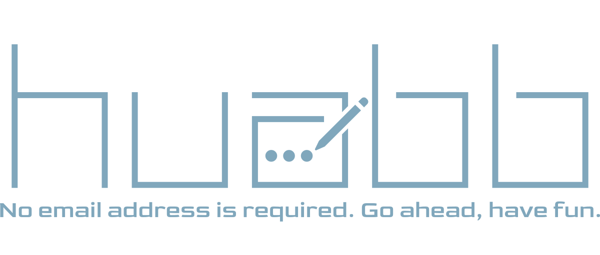

# HuaBB

Discordサーバー
https://discord.gg/yM8BNXuwDB



この素敵なアイコンは夜の無意識さんが書いてくれました！
ありがとうございます！

**※初心者なのででたらめぐちゃぐちゃコードでエラー多発なのはお許しください**

※あと、mdファイル書いたことないのでよくわかんないことになってると思います()

**※ベータ版なのでバグなど至らぬところが大量にあります。**

## How To Install

Laravelで必要なものや、Apacheのmod_rewriteを入れて使ってください。  

Debian系推奨です(CentOSでもできるかもしれないけどやり方違うので自分で調べてちょ(めんどくさい))

PHP8.0推奨です

PHP8.0の入れ方は、

Ubuntuの場合は

```Ubuntu
sudo add-apt-repository ppa:ondrej/php
sudo apt install -y php php-mysql php-sqlite3 php-gd php-dom zip unzip openssl libcurl4-openssl-dev libssl-dev php-curl
```

でインストールできます
Apacheで動かすときはApacheのインストールは

```Ubuntu
sudo apt install apache2
```

でできます

```Ubuntu
sudo a2enmod rewrite
```

でrewriteを有効にしてください(有効にしないとホーム以外のページが開かなくなります)

https://mikepon.jp/ubuntu_develop/

(参考先)

あと、容量の関係上配布時はvendorフォルダとnode_modulesフォルダは抜いてあるので

```Ubuntu
php -r "copy('https://getcomposer.org/installer', 'composer-setup.php');"
php -r "if (hash_file('sha384', 'composer-setup.php') === '756890a4488ce9024fc62c56153228907f1545c228516cbf63f885e036d37e9a59d27d63f46af1d4d07ee0f76181c7d3') { echo 'Installer verified'; } else { echo 'Installer corrupt'; unlink('composer-setup.php'); } echo PHP_EOL;"
php composer-setup.php
php -r "unlink('composer-setup.php');"
sudo mv composer.phar /usr/local/bin/composer
// このコマンドはHuaBBではない他のディレクトリで実行してね！
// インストールした人はここらへんはスキップしてね
```

https://getcomposer.org/download/

でComposerをインストールして

```Ubuntu
sudo apt install npm
// インストールした人はここらへんはスキップしてね
```

https://nodejs.org/en/download/

でnpmをインストールします。

そうしたら、HuaBBのディレクトリで

```npm
npm run dev && composer install
```

を実行してください(これでできるかな())

mysqlを使う場合は、
mariadb推奨です

mariadbのインストール方法は、

```Ubuntu
sudo apt install mariadb-server
```

でインストールしてください

初期設定は各自で調べてしてください(めんどくさい)

また、.envファイルは入ってないので.env.exampleファイルをコピーして.envにしてください。

データベースをサイトでいじるならこれを使ってください。

https://www.adminer.org

```.env
DB_CONNECTION=mysql
DB_HOST=127.0.0.1
DB_PORT=3306
DB_DATABASE=// ここにデータベース名を入力
DB_USERNAME=// データベースのユーザ名を入力(rootでもいいよ)
DB_PASSWORD=// データベースのユーザのパスワードを入力
```

追記: DM機能の追加でSQLiteが使えなくなりました。
申し訳ございません。

追記: 通知の機能が追加されたため、使う前にvapidを生成してください。
```vapid生成コマンド
php artisan webpush:vapid // 通知機能は、sslを有効にしないと使えないから注意！
```

また、一部の機能は、setup.shで生成できるようになりました。

## How to use

./start.shで実行できますが、

Apacheとかで動かす場合は、

public/index.phpを割り当ててください。

Windowsの場合はしらん！(でたらめ)

まだβ版なのでバグがめちゃくちゃあります。

そこはご了承

ロールはデータベースからusersのroleを0に設定すると管理者、1にするとオーナーになります。

アイコンは、ロールをを0に設定して設定ページから「このフォーラムのトップ画像」を変えると変えられます。

大きさはトップ画像の大きさ(横)から変えられます

(前は一時変更しかできなかった(だめじゃん))

初期設定ではpngは使えません(画質荒くなるからね)

pngに変更するには結構設定が必要なので知識のある方は頑張ってやってみてください。

セキュリティはしらね
SQLインジェクションとかは対策できてないですねこれ多分()

そこはご了承
バグがあったら報告してね

では頑張ってね

あっあと、デバッグモードはデフォルトでオンだからそこは自分で解除してね(アップデートでアドミン権限があれば変更できるようになったよ)

エディターには
Trumbowyg(https://alex-d.github.io/Trumbowyg/)
を使っています。

色々なサイトを参考にして作りました。ありがとうございます。

アイコン
https://icon-rainbow.com

## ChangeLog

```changelog
2021年5月3日:
Beta1.0: 初期版完成
Beta1.0.1: マイページ追加
Beta1.0.2: リードミーなど追加
Beta1.0.3: 細かな修正
2021年5月9日:
Beta1.1: 他のユーザでログインしたときにボタンをでなくした。など色々
2021年5月29日:
Beta1.1.1: アイコンを変えました
Beta1.1.2: 細かな修正
2021年5月31日:
Beta1.1.3: アイコンを設定できるようになったよ！
2021年6月1日:
Beta1.1.4: Beta1.1.3でアイコンがたまに表示されなくなるのを修正、その他アイコンの位置など
2021年6月4日:
Beta1.1.5: マイページからアイコンを変更できるようになりました！
2021年6月6日:
Beta1.2: アイコンをホームに出せるようにしたりバグ修正をしました！(バグに気づかなかったよ())
2021年6月15日:
Beta1.2.1: remember_tokenっているの？
2021年6月16日:
Beta1.2.2: 画像の更新にバグが有ったので修正
2021年6月17日:
Beta1.2.3: 降順で投稿が表示されるようになった。
Beta1.3: 検索機能追加(まだPostしか検索できないけど)。
Beta1.3.1: ちょっとしたバグ修正
Beta1.3.2: 治ってなかった()
Beta1.3.3: なんか変えた(でたらめ)
2021年06月18日:
Beta1.3.4: リプライも検索できるようになった。
Beta1.3.5: バグ修正
Beta1.4: 日付が出るようになった&バグ修正
Beta1.4.1: リプライ表示時に画像が出ないのを修正
2021年06月19日:
Beta1.4.2: 検索の順番を変えて、強制的にバグ修正
Beta1.4.3: {!! @post->hoge !!}でhtml文できるんすな。
2021年07月16日:
8.0Beta1.5: Laravel8にまるごと更新 CSSが変わった
2021年07月17日:
8.0Beta1.5.1: バグ修正(リプライアイコンが更新されないのを)
8.0Beta1.6: WYSIWYGエディタをwangEditorに変更。中央揃えが効くようになりました。
8.0Beta1.6.1: タイトルを何も入力していないときにカギカッコが残らないように修正(リプライの場所)
2021年07月18日:
8.0Beta1.6.2: 削除警告メッセージ復活！その他色々修正(ポップアップメッセージなど)
2021年8月11日:
8.0Beta1.7: 権限機能を追加など(権限でどういった事ができるかはまだ決まってない。)
2021年9月4日:
8.0Beta1.7.1: 更新サボってました(言い訳するととあるMinecraftサーバーとかで忙しかったんです許してくださいなんでもしますから(ry) サイトのアイコンをいじれるようにしました。(管理者のみ)
2021年9月7日:
8.0Beta1.7.2: サイトのアイコンをちゃんといじれるようにしました .envファイルの最後の行の "TopImageSize=" の値をかえてもかえられるよ
8.0Beta1.7.3: ちょっとした(大きい)バグ修正(検索が逆になってたやつ)
8.0Beta1.7.4: バグ修正(削除するときに警告が出ないバグを修正)
2021年9月13日:
8.0Beta1.8.0: プロフィール文を追加、他人のプロフィール画面を追加、その他仕様変更など
Beta1.8.1: コードの無駄な部分を削除しました。あとは出なかった削除メッセージがすべてのページで出るようになったよ。あとは<h*>とかclass使わないと意味ないから<h*>から<font>にしてみたり(cssめんどくさい)
2021年9月14日:
Beta1.9: 通知機能が追加されました！@はつけてもつけなくてもおｋ。一応タイトルも対応してます。あとは細かなバグや構文の見直しを少ししました！
Beta1.10: 長かったページを区切るようにしました。その他バグ修正やサイト名画変更できるように
2021年9月15日:
Beta1.10.1: ついにスマホ表示に対応しました！(ですがこのサイトはPCでやることを想定してるので注意)
2021年9月16日:
Beta1.10.2: デバッグモードが変更できるようになったよ。あと、デフォルトでnode_modulesとvendorを抜くようにしたよ(たまに忘れるかも())
Beta1.10.3: Adminで権限設定時にエラーが起きるバグを修正...?
2021年9月22日:
Beta1.11: everyone機能(管理者のみ)追加、アイコンクリックでプロフィール機能(管理者やマイページ)、プロフィールに何も入力してないときにnullと赤文字で表示されるようになりました。その他バグ修正
Beta1.12: 絵をかけるようになったよ！(まあ入れるのは手動だけど)
2021年11月08日:
Beta1.13: ルートのやり方を名前指定にしたよ。 その他バグ修正。
2021年11月10日:
Beta1.14: indexなどの表示方法を変えました。また、デフォルト画像を設定しました。
Beta1.14.1: バグ修正
2021年11月13日:
Beta1.15: スマホ表示にも一応対応、他にもバグ修正など
2021年11月20日:
Beta1.16: DM機能追加、その他バグ修正？(したっけ)
2021年11月21日:
Beta1.16.1: プロフィールの画像が表示されるようになった
Beta1.16.2: バグ修正
2021年11月26日:
Beta1.17: 通知の個数を表示する機能を追加
2021年11月27日:
Beta1.17.1: バグ修正など(createに変更したりなどセキュリティの強化)
Beta1.18: フラッシュメッセージが表示されるようになり、通知の個数ではなくpingを表示するように変更
2021年11月28日:
Beta1.18.1: 大きなバグ(リプライのエディットができない)を修正、アニメーションを付けたりした
2021年11月29日:
Beta1.18.2: アニメーションを付けて、アイコンも変えてみた。あとはバグ修正かな
Beta1.18.2.1: 画像入ってたorz
Beta1.18.3: お絵かき以外のパッケージをnpmのパッケージにに変更
Beta1.18.4: 画像の読み込みやファイルの読み込みをassetに変更(まだテストしてないので見えないことがあるかも...)
Beta1.18.5: やっぱり見えなかった！
Beta1.18.6: バグ修正
Beta1.19.0: エディタをTrumbowygに変更
2021年12月13日:
Beta1.19.1~4: 色々ちまちま変更(レイアウトを変更したり)
2021年12月20日:
Beta1.19.6: 校正
2021年12月30日:
Beta1.19.8: TailwindCSSをアップデート
Beta1.19.10: DaisyUIやtailwindcss/typographyなどを導入。
2022年3月29日:
Beta1.26.1: デザイン、レイアウトをアップデート、コントローラーにコメントアウトを追加などいろいろ
2022年3月30日:
Beta1.27: DMの仕様やデザインを改良
2022年4月6日:
Beta1.28: 全体通知、リプライ、DMを送ったときに通知が来るパッケージを導入してついに実用化(vapidを生成してね！)
Beta1.29: いいね機能を追加、多分普通にやるとうまく通知が来るようになってなかったのを修正(bladeに直書きじゃないとダメ見たい)
2022年4月8日:
Beta1.29.2: 通知をオンにしたときにトースト通知が出るようになった
2022年4月24日:
Beta1.30: ボタンを押して読み込む方式に変わった
2022年4月25日:
Beta1.31.1: Laravel 9にアップグレード
2022年5月8日:
Beta1.32: 投稿などを読み込むときに回転するやつ(読み方忘れた)を出すようにした(多分見えない)、その他バグ修正
2022年5月16日
Beta1.32.1: リロードボタンを改良、サイドバーにユーザ名、ユーザID、ユーザアイコン表示
2022年6月25日
Beta1.32.2: コントローラーを修正？
```
